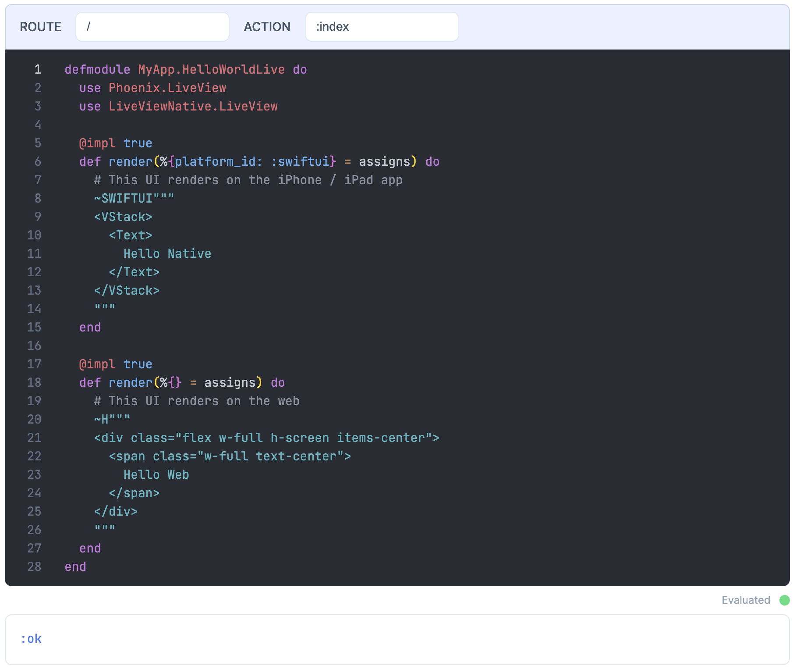

# KinoLiveView

[](https://hex.pm/packages/kino_live_view) [](https://hexdocs.pm/kino_live_view/0.1.0/readme.html)

KinoLiveView lets you dynamically create LiveViews for your Phoenix Application from within a Livebook.

This project is experimental.

## Installation

Add `kino_live_view` to your list of dependencies in `mix.exs`.

```elixir
def deps do
  [
    {:kino_live_view, "~> 0.1.0", only: :dev}
  ]
end
```

Configure `kino_live_view` in `dev.exs`. Replace `MyApp` with your application name.

```elixir
config :kino_live_view,
  enabled: true,
  pubsub_server: MyApp.PubSub,
  router_module: MyAppWeb.Router,
  socket: KinoLiveView.LiveReloader.Socket
```

Use the `KinoLiveView.LiveReloader.Socket` in `endpoint.ex` to allow the `KinoLiveView` project to trigger code reloading.

```elixir
if code_reloading? do
  # Swap the socket from Phoenix.LiveReloader.Socket to KinoLiveView.LiveReloader.Socket.
  # This is important for hot reloaded the project when new LiveViews are injected.
  socket "/phoenix/live_reload/socket", Application.get_env(:kino_live_view, :socket, Phoenix.LiveReloader.Socket)
  plug Phoenix.LiveReloader
  plug Phoenix.CodeReloader
  plug Phoenix.Ecto.CheckRepoStatus, otp_app: :my_app
end
```

Dynamically inject the routes in `router.ex`.

```elixir
if Application.compile_env(:kino_live_view, :enabled) do
  scope "/" do
    pipe_through :browser

    KinoLiveView.get_routes()
    |> Enum.map(fn %{path: path, module: module, action: action} ->
      live(path, module, action)
    end)
  end
end
```

Register the `KinoLiveView.SmartCell` in `application.ex`.

```elixir
  def start(_type, _args) do
    children = [
      # children should be unaffected
      ...
    ]

    # Register the KinoLiveView.SmartCell
    if Application.get_env(:kino_live_view, :enabled) do
      Kino.SmartCell.register(KinoLiveView.SmartCell)
    end

    # See https://hexdocs.pm/elixir/Supervisor.html
    # for other strategies and supported options
    opts = [strategy: :one_for_one, name: MyApp.Supervisor]
    Supervisor.start_link(children, opts)
  end
```

Start your Phoenix server with the `sname` and `cookie` flags.

```sh
$ iex --sname test --cookie mycookie -S mix phx.server
```

Run Livebook as an attached node.


Create a `KinoLiveView` Smart Cell in Livebook.


You should see the new LiveView page on localhost:4000 or whichever URL your server runs on.

This project is also compatible with [LiveView Native](https://github.com/liveview-native/live_view_native).

